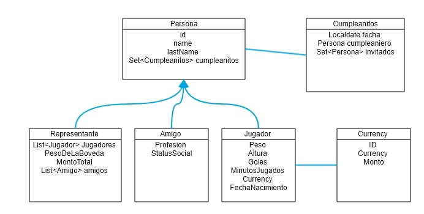

# J-FutbolManager

<p align='left' >

</p>

### Volvimos a los 90 nuestro amigo personal Guillermo nos pide el favor que le hagamos un sistema para poder contar su dinero.
### Dado el siguiente DER
#### Desarrollar lo necesario para el correcto funcionamiento. Toda mejora fundamentada se tomara en cuenta.


* POST /person
* GET  /person
* GET  /person/{id}
* DEL  /person
* PUT  /person/{id}/jugadores/{idJugador} 


* POST /currency
* GET  /currency
* GET  /currency/{id}
* DEL  /currency


## Recuerden
* Respetar el estandar REST.
* El uso correcto de todo lo aprendido (inclusive, buenas practicas de laboratorio 3).
* Los jugadores que representa tienen valores en EUROS y DOLARES, pero nuestro amigo Guillermo actualmente esta en la Argentina con lo que necesita Pesos! asique el montoTotal debe ser calculado en Pesos.
* Cada Billete pesa 1 gramo.


# Recuperatorio 

#### Nuestro amigo Guillermo quiere realizar una fiesta para festejar su cumpleaños,
#### pero tiene tantos amigos que necesita dividir su fiesta ya que solo puede invitar un maximo de 10 personas por evento,
#### Agregar lo necesario para poder dar de alta Amigos y poder vincularlos a la lista de invitados al cumpleanitos.  


# 2do Parcial

#### Llego la hora de pagar la fiesta y nuestro querido Guillermo nos cobra $25.000
#### el problema es que nadie trajo Pesos, solo Dolares y Euros asique debemos emitir un listado con la conversion acorde a los participantes.
```
[
    {
        nombre: Alfio Basile,
        currency: USD
        amount: 25.000 / cotizacion del dolar oficial precio de compra = 265
    },
    {
        nombre: Bambino Veira,
        currency: EUR
        amount: 25.000 / cotizacion del euro precio de compra = 231
    }
]
```
## Importante
* Si no rendiste el recuperatorio solo agrega la clase Cumpleanitos no hace falta la de "Amigos"
* Seguir respetando las buenas practicas
* Realizar los llamados REST a los siguientes endpoints
  * EURO  : https://www.dolarsi.com/api/api.php?type=genedolar&opc=ta
  * DOLAR : https://www.dolarsi.com/api/api.php?type=dolar
* Realizar endpoint que devuelva el listado, con sus respectivos Test.   
